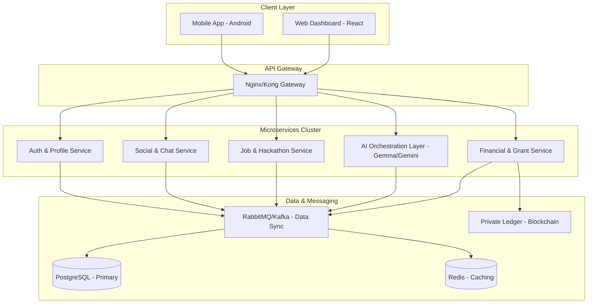
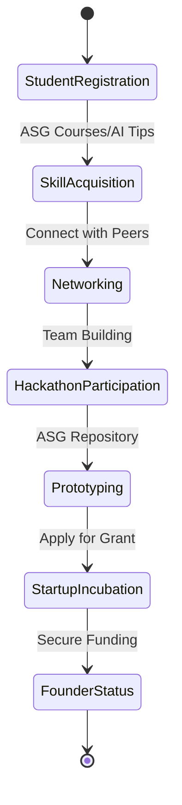
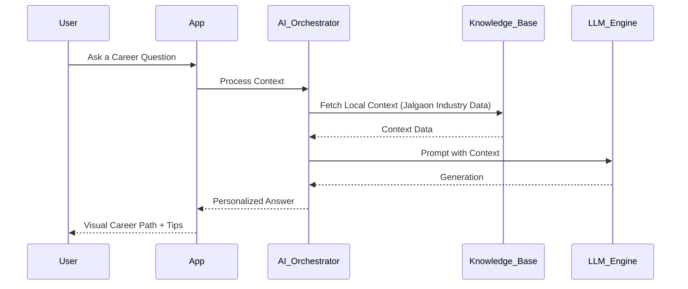

# ASG Community Ecosystem: Bridging Regional Innovation Gaps
> **Pitch Document for Grant Financing & Strategic Partnership**

## 1. Executive Summary
The **ASG Community App** is a unified ecosystem designed to empower students, startups, and educational institutions in Tier 2 and Tier 3 regions (starting with Jalgaon, Maharashtra). By integrating real-time collaboration, AI-driven mentorship, and institutional accreditation tools, ASG creates a "Digital Special Economic Zone" for local innovators.

---

## 2. Current Technical State
We have successfully built and deployed a functional MVP that includes:
- **Stakeholder Personas**: Dedicated roles for Students, Founders, Investors, Mentors, and SPOCs.
- **Real-time Networking**: WebSocket-powered chat and connection management.
- **AI Integration**: "Kiri AI" - a specialized LLM agent for student queries.
- **Opportunity Hub**: Integrated Job Board and Event Management (Hackathons/Workshops).
- **Modern Stack**: 
    - **Mobile**: Android (Jetpack Compose, MVVM).
    - **Backend**: Node.js, Express, Prisma ORM, PostgreSQL.
    - **Real-time**: Socket.io.

---

## 3. Complete Future Scope

### Phase 1: AI-Agentic Orchestration (Next 6 Months)
- **Specialized AI Mentors**: Deploying agents for Tech, Legal, and GTM (Go-To-Market) strategies.
- **Predictive Matching**: AI algorithms to suggest co-founders and team members based on GitHub/Portfolio analysis.

### Phase 2: Institutional & NAAC Integration (Next 12 Months)
- **Automated Accreditation**: Tools for colleges to automatically track student participation in innovation activities for NAAC/NBA records.
- **Smart Campus Repositories**: Digital archives for student projects and patents.

### Phase 3: The Financial Layer (Next 24 Months)
- **Micro-Grant Marketplace**: A decentralized platform for students to apply for small-scale prototyping grants.
- **Investor Dashboard**: Real-time KPI tracking for regional startups seeking seed funding.
- **Blockchain Credentialing**: Issuing non-fungible certificates for skill verification.

---

## 4. Updated Architecture Wireframe

### Future Scalable Architecture
To handle regional scaling, we are transitioning to an **Event-Driven Microservices Architecture**.



---

## 5. System Diagrams

### 5.1 Innovation Lifecycle Flow
How a student transforms into a founder within the ASG Ecosystem.



### 5.2 Data Flow: AI-Agentic Orchestration
How Kiri AI interacts with the user and external data.



---

## 6. Project Structure (Future Roadmap)

```text
ASG_ECOSYSTEM/
├── android_app/           # Existing Compose App (Scale to Multi-module)
│   ├── core/              # Shared logic & UI components
│   ├── feature_auth/      # Independent module
│   ├── feature_social/    # Networking & Chat
│   └── feature_ai/        # Kiri Personalization
├── web_dashboard/         # [NEW] Admin/College/Investor Web App
├── backend_services/      # Transitioning to Microservices
│   ├── auth_service/
│   ├── notification_svc/  # Centralized push system
│   ├── ai_agent_svc/      # LLM API orchestrator
│   └── blockchain_node/   # Verification ledger
├── infra/                 # Kubernetes & CI/CD
└── docs/                  # Global API Specs
```

---

## 7. Grant Fulfillment & Value Proposition
- **Social Impact**: Boosting GDP of Tier 2/3 regions by reducing brain drain.
- **Transparency**: Every grant rupee is tracked via the blockchain ledger.
- **Scalability**: Blueprint can be replicated for any regional hub globally.
- **Institutional Growth**: Colleges gain better accreditation scores through documented innovation.

---
*Created by the ASG Engineering Team.*
